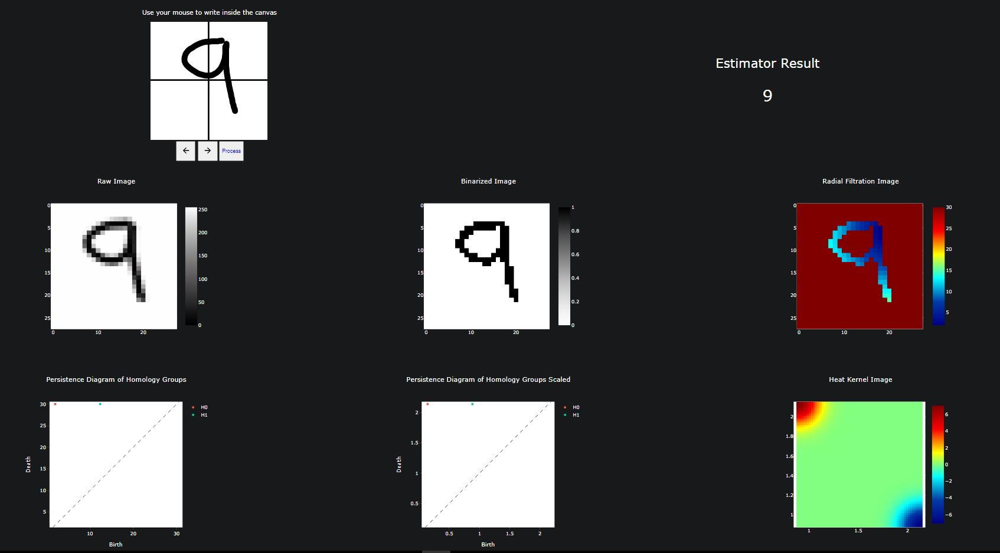

#Classifying Handwritten Digits
Dash application demonstrating a giotto-tda pipeline for classifying handwritten digits.

The code *closely* follows the giotto-tda tutorial found [here](https://giotto-ai.github.io/gtda-docs/latest/notebooks/MNIST_classification.html).

##Using the Dashboard
A live deployment of the dashboard can be found [here](http://digitidentificationtda-env.eba-g7vvbzer.us-west-2.elasticbeanstalk.com/). To use the dashboard, draw a single digit in the canvas and click the **Process** button. Shortly after, the estimator result should post alongside a series of plots showing the pipeline used for the handwritten digit.



##Understanding the Plots
See [giotto-tda](https://giotto-ai.github.io/gtda-docs/0.5.1/library.html).

##Backend Estimator
The pipeline showed by the plots on the dashboard is a simplified version of what is actually used on the backend. A pickled version of the actual estimator pipeline can be found [here](data/model_pipeline.sav). To load this pipeline simply run:

```python
import pickle

model = pickle.load(open("model_pipeline.sav", 'rb'))
```

Alternatively, one can regenerate this pipeline (or improve it!) by using the scripts in [pipeline_utils](pipeline_utils).

[train_pipeline.py](train_pipeline.py) shows the actual pipeline used on the backend. Most recently the pipeline was trained on 2,000 MNIST imaged and scored 94% on a test size of 300.

Using [grid_search.py](grid_search.py) one can find the best hyperparameters to improve the estimator accuracy. According to the above cited tutorial, training on the full MNIST dataset and optimizing the hyperparameters, one can achieve a score of 96%.
